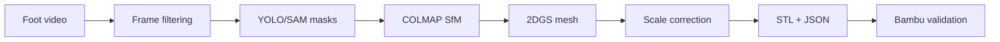
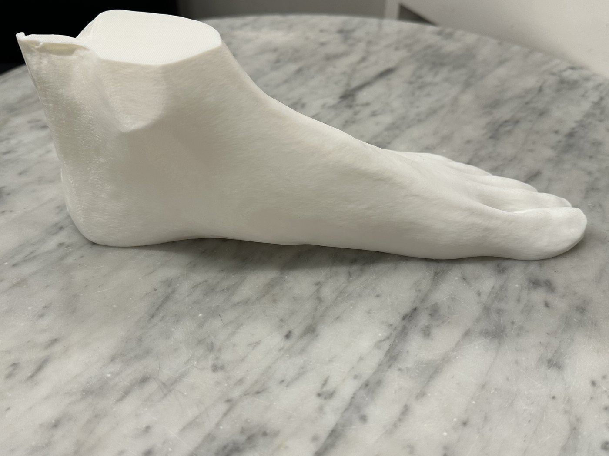
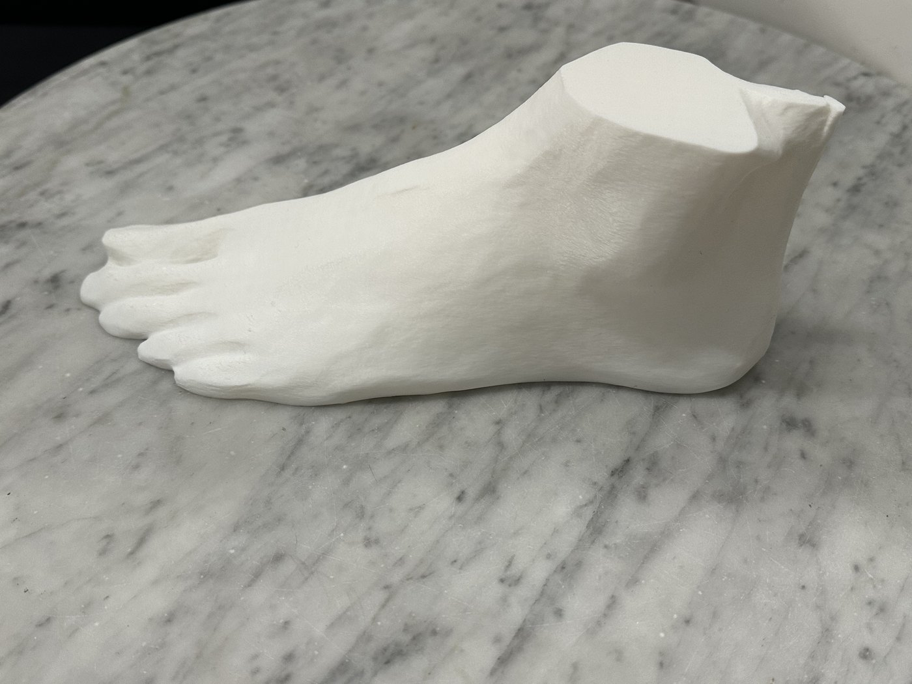
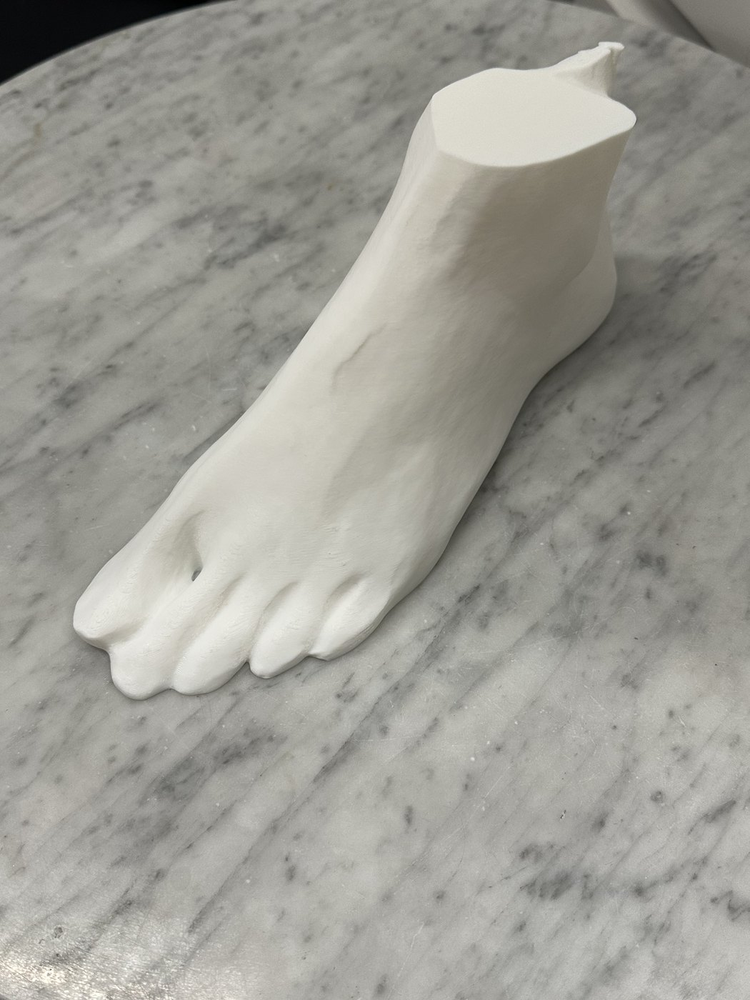
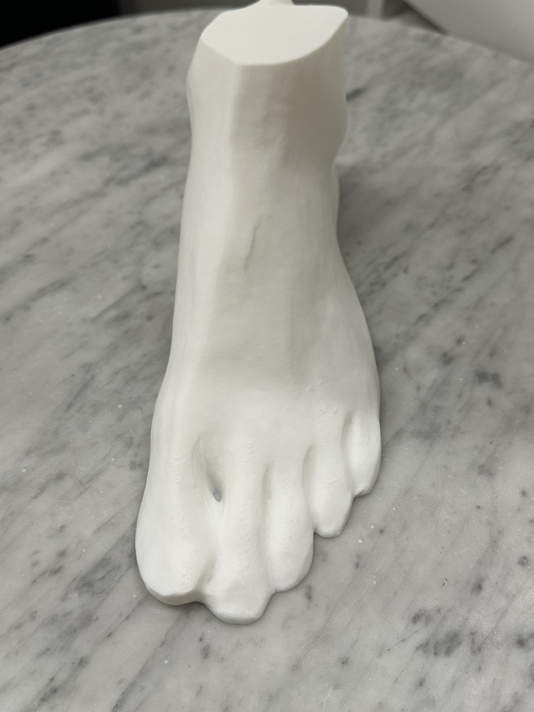
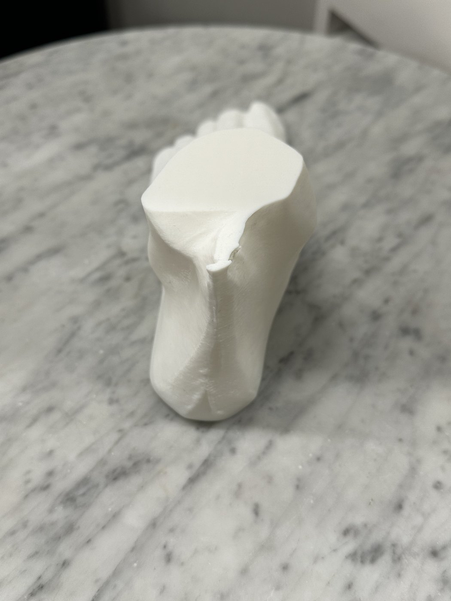
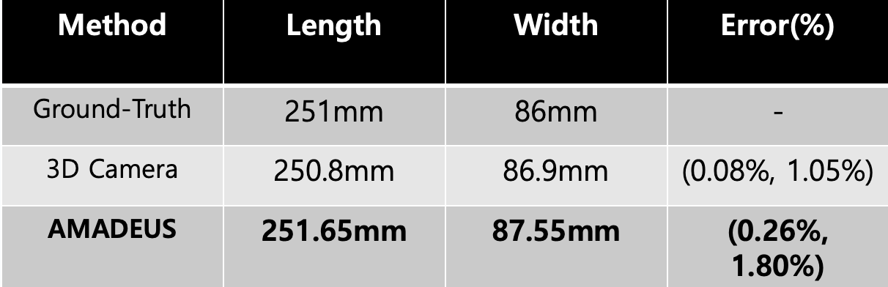
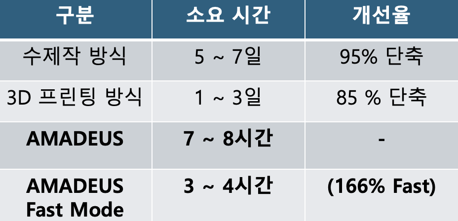
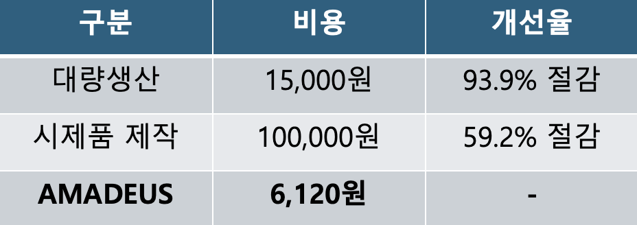
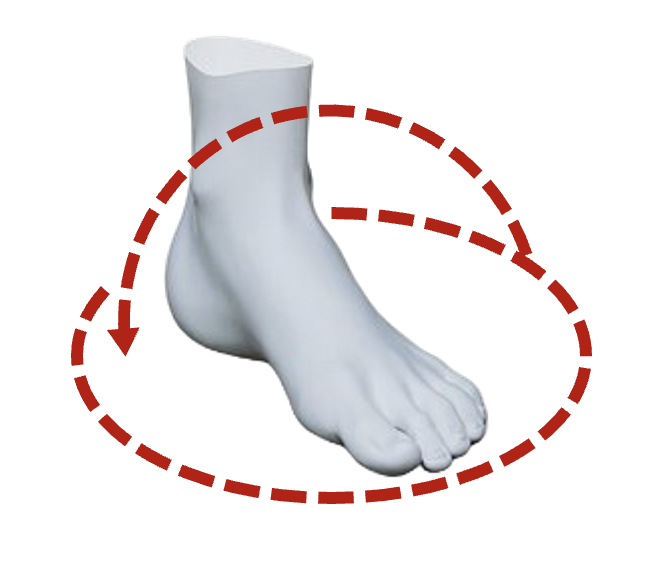

<div align="center">

# AMADEUS

### AI-assisted real-scale foot reconstruction for custom shoe-making

From a smartphone foot video to a printable, scale-corrected 3D foot mesh.

<p>
  
  
  
  
</p>

<p>
  <a href="docs/WORKFLOW.md">Workflow</a>
  ·
  <a href="docs/CAPTURE_GUIDE.md">Capture Guide</a>
  ·
  <a href="docs/REPRODUCIBILITY.md">Reproducibility</a>
  ·
  <a href="docs/OUTPUT_SPEC.md">Output Spec</a>
  ·
  <a href="web/README.md">Web Runner</a>
</p>

</div>

---

## Overview

AMADEUS is an AI-assisted foot morphology analysis and custom shoe-making support system. It reconstructs a user's foot in 3D from a smartphone RGB video, recovers real-world scale using a checkerboard reference, postprocesses the mesh, exports STL/JSON outputs, and validates the result through Bambu Studio slicing and 3D printing.

This repository contains the public workflow documentation, project scaffold, and a browser-based web runner that can execute the final AMADEUS pipeline command after team integration.

## What AMADEUS Produces

| Input | Core Reconstruction | Output |
| --- | --- | --- |
| Smartphone video of a foot and checkerboard | YOLO/SAM segmentation, COLMAP SfM, 2D Gaussian Splatting, mesh repair, scale correction | Real-scale STL, measurement JSON, processing report, slicer-ready 3MF |

## Workflow At A Glance



## Prototype Output Gallery

Early physical print of the reconstructed foot mesh. These views are included to show the intended final artifact: a tangible, scale-corrected foot model that can support downstream custom shoe-last design and fit validation.

<table>
  <tr>
    <td align="center" width="50%">
      <br>
      <sub>Side profile</sub>
    </td>
    <td align="center" width="50%">
      <br>
      <sub>Opposite side profile</sub>
    </td>
  </tr>
  <tr>
    <td align="center" width="50%">
      <br>
      <sub>Top oblique view</sub>
    </td>
    <td align="center" width="50%">
      <br>
      <sub>Dorsal detail</sub>
    </td>
  </tr>
  <tr>
    <td align="center" colspan="2">
      <br>
      <sub>Heel and ankle view</sub>
    </td>
  </tr>
</table>

## Benchmark Results

<table>
  <tr>
    <td align="center">
      <br>
      <sub>Size result</sub>
    </td>
  </tr>
  <tr>
    <td align="center">
      <br>
      <sub>Time result</sub>
    </td>
  </tr>
  <tr>
    <td align="center">
      <br>
      <sub>Cost result</sub>
    </td>
  </tr>
</table>

## Why This Matters

| Existing bottleneck | AMADEUS direction |
| --- | --- |
| Expensive 3D foot scanners and LiDAR-specific hardware | Use a broadly available smartphone RGB camera |
| Manual, time-intensive shoe-last production | Automate reconstruction, scaling, and mesh export |
| Weak public foot datasets for this domain | Build a capture and labeling workflow for custom data |
| Unscaled photogrammetry output | Recover real-world scale from an A4 checkerboard |
| Mesh artifacts from single-object reconstruction | Use 2DGS and postprocessing for cleaner foot surfaces |

## Capture Motion

The camera should move slowly around the foot while keeping both the foot and checkerboard visible. See the full [Capture Guide](docs/CAPTURE_GUIDE.md) for details.

<p align="center">
  
</p>

## Repository Layout

```text
AMADEUS/
  README.md
  docs/
    WORKFLOW.md
    CAPTURE_GUIDE.md
    REPRODUCIBILITY.md
    OUTPUT_SPEC.md
    assets/
      capture-orbit-guide.png
      results/
        printed-foot-001.jpg
        printed-foot-002.jpg
        printed-foot-003.jpg
        printed-foot-004.jpg
        printed-foot-005.jpg
  src/
    .gitkeep
  docker/
    .gitkeep
  data/
    samples/.gitkeep
  models/
    .gitkeep
  outputs/
    .gitkeep
  web/
    README.md
    docker-compose.yml
    backend/
      app/
        main.py
        static/
```

## Documentation

| Document | Purpose |
| --- | --- |
| [Workflow](docs/WORKFLOW.md) | Full technical pipeline from video capture to print validation |
| [Capture Guide](docs/CAPTURE_GUIDE.md) | How to record foot/checkerboard videos that work well with COLMAP and 2DGS |
| [Reproducibility Plan](docs/REPRODUCIBILITY.md) | Target runtime, Docker plan, model-weight handling, and execution assumptions |
| [Output Specification](docs/OUTPUT_SPEC.md) | Expected intermediate and final files |
| [Web Runner](web/README.md) | Browser upload flow that runs a configurable pipeline command and serves STL/3MF/report outputs |

## Core Technologies

| Layer | Technology |
| --- | --- |
| Frame processing | FFmpeg, OpenCV |
| Segmentation | YOLOv11n-seg, SAM |
| Camera pose estimation | COLMAP SfM |
| 3D reconstruction | 2D Gaussian Splatting |
| Mesh postprocessing | Open3D, Trimesh |
| Print validation | Bambu Studio, OrcaSlicer |

## Current Status

```text
Documentation scaffold        done
Repository structure          done
Web pipeline runner           done
Final pipeline source         pending team code replacement
Docker runtime                web runner done / CUDA pipeline pending
Model weights                 external release planned
Public demo data              pending privacy review
```

## Web Runner Quick Start

Place the final integrated pipeline script at `src/pipeline.py`, or point `AMADEUS_PIPELINE_CMD` to the correct script path.

```bash
cd web
export AMADEUS_PIPELINE_CMD='python /pipeline/pipeline.py --input-video {input_video} --output-dir {output_dir}'
docker compose up --build
```

Open `http://localhost:8000`, upload an `.mp4`, and the result page will expose generated STL, 3MF, reports, and logs.

## Open Source Release Plan

1. Publish workflow and execution documentation.
2. Add the final pipeline source code after team integration.
3. Provide a Docker-based reproducible runtime.
4. Link trained YOLO segmentation weights through Hugging Face or release assets.
5. Add public demo input/output samples where privacy and file-size constraints allow.

## Privacy Note

This repository intentionally avoids committing private raw foot videos, personal data, large model weights, and generated print files. Use `data/samples/` only for public demo data.
