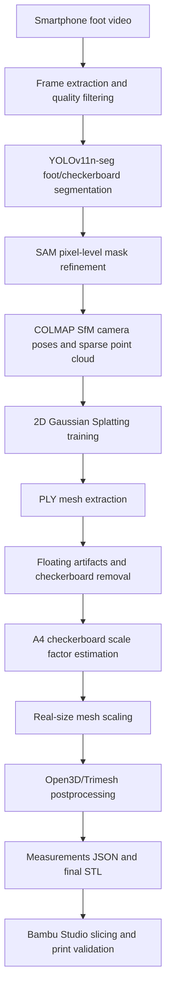

# AMADEUS Workflow

이 문서는 AMADEUS 과제 계획서의 기술 흐름을 GitHub 공개용으로 정리한 워크플로우입니다.

## Goal

스마트폰 RGB 영상만으로 사용자의 발 형상을 3D 재구성하고, 수제화 제작 보조에 사용할 수 있는 실제 크기 STL/JSON 결과물을 생성합니다. 고가의 3D 발 스캐너나 LiDAR 전용 장비 없이 접근 가능한 입력으로 제조 가능한 결과물을 만드는 것이 목표입니다.

## End-to-End Flow

## 1. Video Input and Frame Filtering

입력은 사용자가 스마트폰으로 촬영한 발 영상입니다.

처리 내용:

- FFmpeg/OpenCV 기반 프레임 추출
- 흔들림, 과노출, 흐림 등 품질 저하 프레임 제거
- COLMAP/2DGS에 사용할 대표 프레임 선별

권장 입력:

- 발 전체와 A4 체커보드가 동시에 보이는 영상
- 발 주변을 천천히 회전하며 촬영한 영상
- 반사나 그림자가 강하지 않은 조명

## 2. Foot and Checkerboard Segmentation

발과 체커보드를 분리하기 위해 YOLOv11n-seg 기반 segmentation을 사용합니다.

처리 내용:

- 직접 촬영한 발 이미지 데이터셋 구축
- Roboflow 등을 통한 라벨링/증강
- foot mask, checkerboard mask 생성
- YOLO segmentation 결과를 SAM으로 후처리하여 더 정밀한 pixel-level mask 생성

산출물:

- `segmentation/foot/`
- `segmentation/checkerboard/`
- `segmentation/both/`

## 3. COLMAP SfM

COLMAP은 프레임 간 카메라 포즈를 추정하고 sparse point cloud를 생성합니다.

처리 내용:

- SIFT 기반 feature extraction
- sequential/exhaustive matching
- 발과 체커보드가 포함된 영역 중심의 matching
- `cameras.bin`, `images.bin`, `points3D.bin` 생성

주의점:

- 발 표면은 매끈해서 특징점이 적습니다.
- 촬영 시 발 또는 주변에 추적 가능한 시각적 특징이 충분해야 합니다.
- A4 체커보드는 scale 보정을 위해 반드시 함께 촬영합니다.

## 4. 2D Gaussian Splatting Reconstruction

COLMAP 결과를 2DGS의 초기 입력으로 사용하여 발 표면을 재구성합니다.

2DGS 채택 이유:

- 3DGS의 3D ellipsoid 대신 2D disk 기반 Gaussian을 사용
- 단일 오브젝트 표면을 더 직접적으로 모델링
- 발바닥/발등의 닫힌 구간 형성에 유리
- watertight mesh 달성이 상대적으로 쉬움

산출물:

- 2DGS reconstruction PLY
- mesh extraction 결과 PLY

## 5. PLY Postprocessing

2DGS 결과에는 발 외 부유물, 체커보드 영역, 불필요한 바닥 영역이 포함될 수 있습니다.

처리 내용:

- floating artifacts 제거
- checkerboard 영역 제거
- 발바닥 절단면 처리
- 구멍 메우기
- watertight mesh 형성

사용 기술:

- Open3D
- Trimesh
- 필요 시 PyMeshLab/MeshFix 계열 repair

## 6. Scale Factor Estimation

2D reconstruction 결과는 절대 스케일이 없기 때문에 실제 크기 보정이 필요합니다.

처리 내용:

- 함께 촬영한 A4 체커보드 영역의 PLY 분포 추출
- 실제 A4 크기 또는 체커보드 한 칸 크기와 재구성 크기 비교
- scale factor 계산
- 발 mesh에 scale factor 적용

기준 예시:

- A4 paper: `297 mm x 210 mm`
- checker square: 프로젝트 설정에 따라 별도 지정

## 7. Measurement and Export

스케일이 적용된 mesh에서 주요 치수를 측정하고 출력합니다.

예상 치수:

- foot length
- foot width
- instep height
- bounding box
- mesh volume/area where available

최종 산출물:

- final foot STL
- measurements JSON
- processing report JSON/TXT

## 8. Bambu Studio Validation

완성된 STL을 Bambu Studio 또는 OrcaSlicer로 slicing하고 3D 프린터로 출력 검증합니다.

검증 항목:

- slicer에서 정상 로딩되는지
- support/floating region 경고 여부
- printability
- 실제 발과 출력물 크기 비교

## Known Limitations

- 한국인/동양인 발 이미지 데이터셋 부족
- 발 표면의 낮은 texture로 인한 COLMAP 실패 가능성
- 촬영 품질과 조명에 따른 segmentation/reconstruction 품질 편차
- 모델 가중치와 샘플 영상은 개인정보와 용량 문제로 별도 배포 필요

## Future Extensions

- FastAPI backend
- React Native mobile capture app
- Bambu Cloud upload integration
- custom shoe last generation
- sports/outdoor custom equipment workflow
- hand/face/dental medical-assistive adaptation
