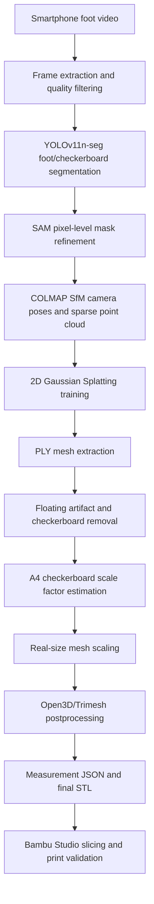

# AMADEUS Workflow

This document summarizes the public technical workflow for AMADEUS.

## Goal

AMADEUS reconstructs a real-scale 3D foot mesh from a smartphone RGB video and produces outputs that can support custom shoe-making workflows. The system is designed to reduce reliance on expensive 3D foot scanners, LiDAR-specific hardware, and fully manual shoe-last production steps.

## End-to-End Flow

## 1. Video Input and Frame Filtering

The input is a smartphone video of the user's foot and a checkerboard reference.

Processing steps:

- Extract frames with FFmpeg/OpenCV.
- Remove low-quality frames caused by blur, overexposure, or heavy shake.
- Select representative frames for COLMAP and 2DGS.

Recommended input:

- A video where the full foot and A4 checkerboard are visible together.
- Slow orbiting camera motion around the foot.
- Stable lighting with limited reflections and shadows.

## 2. Foot and Checkerboard Segmentation

YOLOv11n-seg is used to separate the foot and checkerboard regions.

Processing steps:

- Build a foot-specific image dataset.
- Label and augment foot/checkerboard masks.
- Fine-tune YOLOv11n-seg.
- Refine YOLO masks with SAM for pixel-level segmentation quality.

Expected outputs:

- `segmentation/foot/`
- `segmentation/checkerboard/`
- `segmentation/both/`

## 3. COLMAP SfM

COLMAP estimates camera poses and generates a sparse point cloud.

Processing steps:

- SIFT feature extraction
- Sequential or exhaustive image matching
- Camera pose estimation
- Sparse model export as `cameras.bin`, `images.bin`, and `points3D.bin`

Notes:

- Foot surfaces often have weak texture, which can make feature matching difficult.
- The capture scene should include enough trackable visual features.
- The A4 checkerboard must be captured with the foot so scale can be recovered later.

## 4. 2D Gaussian Splatting Reconstruction

COLMAP outputs are used as the initialization for 2D Gaussian Splatting.

Why 2DGS:

- It uses 2D disk-based Gaussians rather than 3D ellipsoids.
- It can model a single object surface more directly.
- It is better suited for smooth, watertight surface reconstruction in this workflow.
- It avoids the additional complexity previously required by 3DGS + SuGaR style mesh extraction.

Expected outputs:

- 2DGS reconstruction PLY
- Extracted mesh PLY

## 5. PLY Postprocessing

The raw 2DGS result may include floating artifacts, checkerboard remnants, floor fragments, or open boundaries.

Processing steps:

- Remove floating artifacts.
- Remove checkerboard/floor geometry.
- Trim the foot mesh.
- Fill holes and cap cut planes.
- Build a watertight mesh when possible.

Tools:

- Open3D
- Trimesh
- Optional PyMeshLab/MeshFix-style repair stages

## 6. Scale Factor Estimation

The reconstructed 3D scene does not have an absolute real-world scale. A scale factor is estimated using the checkerboard.

Processing steps:

- Extract the checkerboard distribution from the reconstructed PLY.
- Compare reconstructed dimensions with the known A4/checkerboard size.
- Compute a scale factor.
- Apply the scale factor to the foot mesh.

Reference examples:

- A4 paper: `297 mm x 210 mm`
- Checker square size: configurable per printed board

## 7. Measurement and Export

After scaling, the mesh can be measured and exported.

Expected measurements:

- Foot length
- Foot width
- Instep height
- Bounding box
- Mesh volume/area where available

Final outputs:

- Final foot STL
- Measurement JSON
- Processing report JSON/TXT

## 8. Bambu Studio Validation

The final STL is loaded into Bambu Studio or OrcaSlicer for slicing and print validation.

Validation checklist:

- The STL loads correctly.
- The slicer does not report critical non-manifold errors.
- Floating region/support warnings are reviewed.
- Printed output is compared against the real foot scale.

## Known Limitations

- Lack of a large Korean/East Asian foot image dataset
- COLMAP failure risk due to low texture on smooth foot surfaces
- Sensitivity to capture quality, lighting, and motion blur
- Model weights and sample videos require separate distribution due to privacy and file-size constraints

## Future Extensions

- FastAPI backend
- React Native capture app
- Bambu Cloud upload integration
- Custom shoe-last generation
- Sports/outdoor custom equipment workflow
- Adaptation to hand, face, dental, or medical-assistive modeling
